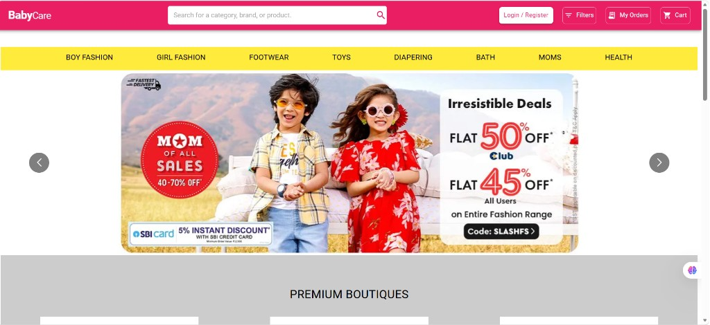
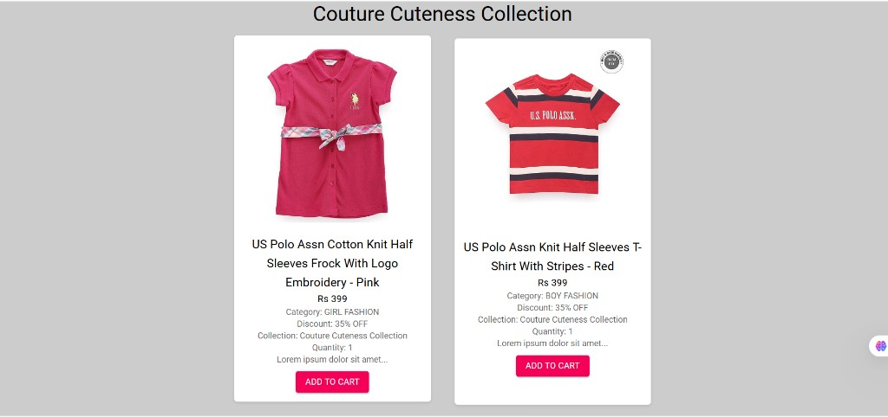
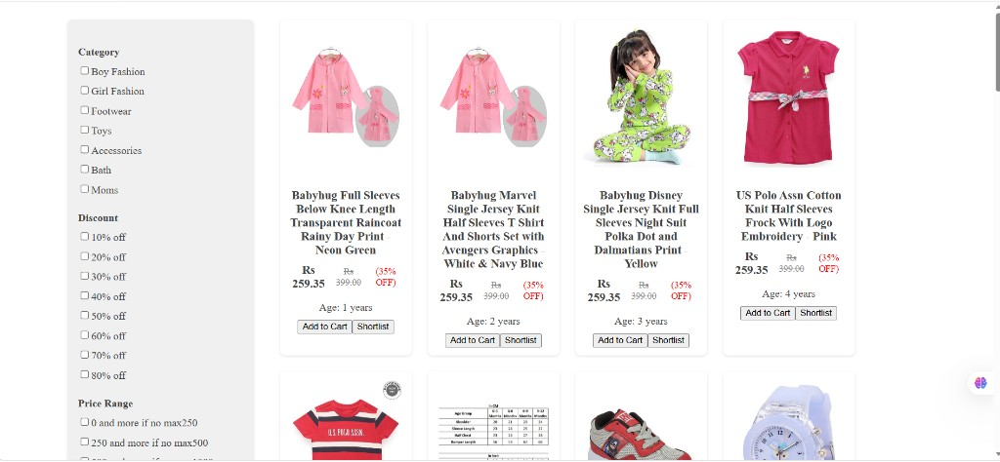
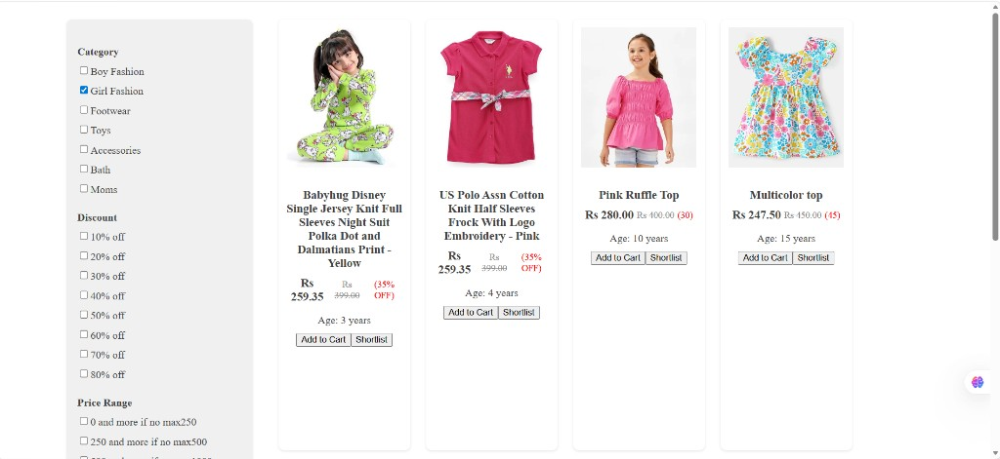
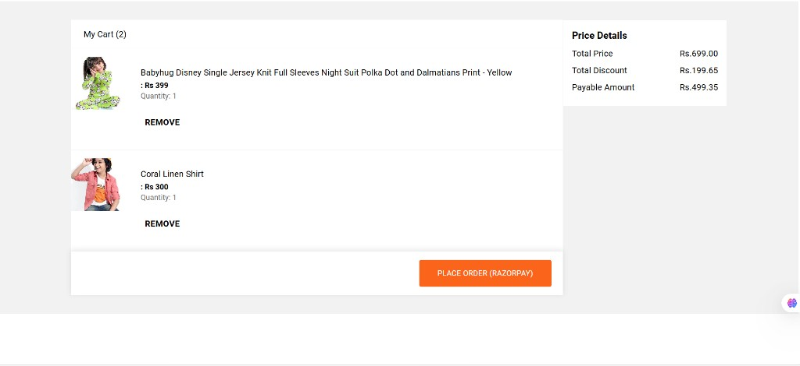
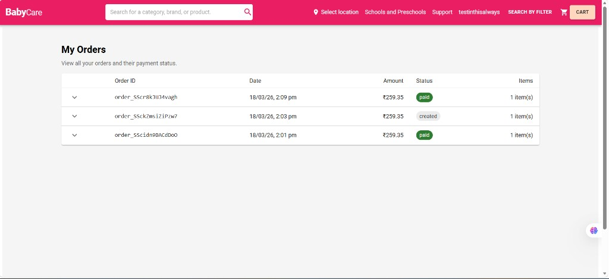

# BabyCare

A full-stack e-commerce web application for baby and kids products, built with React, Node.js, Express, MongoDB, and Razorpay payment integration. Features product browsing by collections, category-based filtering, cart management, secure authentication, and a complete payment flow with order tracking.

---

## Live Demo

> Running locally on `http://localhost:3000` (client) and `http://localhost:8000` (server).

---

## Tech Stack

| Layer       | Technology                                                    |
|-------------|---------------------------------------------------------------|
| Frontend    | React 18, Material-UI 5, Redux + Redux Thunk, React Router 6 |
| Backend     | Node.js, Express 4                                            |
| Database    | MongoDB Atlas via Mongoose 8                                  |
| Auth        | bcrypt (password hashing), JSON Web Tokens (JWT)              |
| Payments    | Razorpay (test mode) with signature verification and webhooks |
| Other       | Axios, react-toastify, react-multi-carousel                   |

---

## Features

### Product Browsing
- **Home page** with auto-sliding banner carousel
- **Category navigation** with dropdown menus (Boy Fashion, Girl Fashion, Footwear, Toys, Bath, Moms, etc.)
- **Premium Boutiques** section with clickable collection cards
- **Search** functionality across all products
- **Advanced filtering** by category, discount, price range, and age group

### Authentication
- User signup with bcrypt-hashed passwords
- JWT-based login with session persistence
- Protected actions: add to cart, view cart, and place orders require authentication
- Profile dropdown with "My Orders" and "Logout"

### Shopping Cart
- Add/remove products from cart
- Quantity tracking per item
- Real-time price calculation with discount application
- Price breakdown: total price, total discount, and payable amount

### Payment Integration (Razorpay)
- **Create Order API** — server creates a Razorpay order and persists it in MongoDB
- **Razorpay Checkout** — client-side integration with the official Razorpay checkout SDK
- **Signature Verification** — server verifies `razorpay_signature` using HMAC-SHA256 before marking an order as paid
- **Webhooks** — `POST /api/payment/webhook` endpoint with raw body parsing and signature verification; handles `payment.captured` and `order.paid` events for reliable order status updates
- **Order Storage** — every order is stored in the database with status tracking (`created` → `paid` / `failed`)

### Order Management
- **My Orders** page showing all orders with Order ID, date, amount, status (paid/created/failed), and item count
- Expandable order rows to view individual item details and payment IDs

### Responsive Design
- Mobile-first responsive layout across all pages
- Hamburger menu with drawer navigation on mobile
- Responsive grid layouts for product cards, cart, footer, and filter page
- Consistent breakpoints at 480px, 600px, 768px, 960px, and 1024px

---

## Project Structure

```
babyCart/
├── client/                             # React frontend
│   └── src/
│       ├── App.js                      # Route definitions
│       ├── index.js                    # Entry point with Redux Provider
│       ├── index.css                   # Global styles and resets
│       ├── SearchAns.jsx               # Search results page
│       ├── constants/
│       │   └── Data.jsx                # Navigation, banner, and boutique data
│       ├── context/
│       │   └── DataProvider.jsx        # User account context (React Context API)
│       ├── redux/
│       │   ├── store.js                # Redux store configuration
│       │   ├── actions/                # cartActions, productActions
│       │   ├── reducers/               # cartReducer, productReducer
│       │   └── constants/              # Action type constants
│       └── components/
│           ├── Header/                 # AppBar, Search, Profile, Custombutton
│           │   └── filter/             # FilterProd with multi-criteria filtering
│           ├── home/                   # Home, Navbar, Banner, Boutiques
│           ├── cart/                   # Cart, CartItem, TotalBalance
│           ├── orders/                 # Orders page (order history)
│           ├── login/                  # LoginDialog (signup + login modal)
│           ├── Footer/                 # Footer with collection and item links
│           └── Collection.jsx          # Products by boutique collection
│
└── server/                             # Express backend
    ├── server.js                       # App entry, middleware, route mounting
    ├── database/
    │   └── db.js                       # MongoDB Atlas connection
    ├── models/
    │   ├── ProductSchema.js            # Product model
    │   ├── userSchema.js               # User model (username, email, password)
    │   ├── cartSchema.js               # Cart model
    │   └── OrderSchema.js              # Order model (Razorpay IDs, status, items)
    ├── routes/
    │   ├── BoutiqueRoutes.js           # Product and collection endpoints
    │   ├── loginSignupRoute.js         # Signup and login with JWT
    │   ├── cartRoutes.js               # Cart CRUD
    │   └── paymentRoutes.js            # Razorpay: create-order, verify, webhook, orders
    ├── ProductData.js                  # Product seed data
    └── DBdata.js                       # Database seeder
```

---

## API Endpoints

### Authentication
| Method | Endpoint              | Description          |
|--------|-----------------------|----------------------|
| POST   | `/api/loginSignup/signup` | Register a new user  |
| POST   | `/api/loginSignup/login`  | Login and receive JWT|

### Products
| Method | Endpoint                        | Description                    |
|--------|---------------------------------|--------------------------------|
| GET    | `/`                             | Get all products               |
| GET    | `/api/boutiques/:collection`    | Get products by collection     |
| GET    | `/api/boutiques/search/:query`  | Search products                |
| GET    | `/api/boutiques/product/:id`    | Get single product by ID       |

### Cart
| Method | Endpoint            | Description          |
|--------|---------------------|----------------------|
| POST   | `/api/cart/add`     | Add item to cart     |
| GET    | `/api/cart/:username`| Get user's cart     |
| POST   | `/api/cart/remove`  | Remove item from cart|

### Payments (Razorpay)
| Method | Endpoint                      | Description                              |
|--------|-------------------------------|------------------------------------------|
| POST   | `/api/payment/create-order`   | Create Razorpay order + save in DB       |
| POST   | `/api/payment/verify`         | Verify payment signature + update status |
| POST   | `/api/payment/webhook`        | Razorpay webhook (raw body, sig verify)  |
| GET    | `/api/payment/orders`         | List all orders                          |

---

## Payment Flow

```
User clicks "Place Order"
        │
        ▼
Frontend calls POST /api/payment/create-order
        │
        ▼
Server creates Razorpay order ──► Order saved in DB (status: "created")
        │
        ▼
Server returns orderId + keyId
        │
        ▼
Frontend opens Razorpay Checkout popup
        │
        ├── User completes payment ──► Razorpay returns payment details
        │                                      │
        │                                      ▼
        │                     Frontend calls POST /api/payment/verify
        │                                      │
        │                                      ▼
        │                     Server verifies HMAC-SHA256 signature
        │                                      │
        │                                      ▼
        │                     Order updated to "paid" in DB
        │                                      │
        │                                      ▼
        │                     Cart cleared, success toast shown
        │
        └── User cancels ──► Error toast, order stays "created"

Webhook (async backup):
  Razorpay sends payment.captured / order.paid
        │
        ▼
  POST /api/payment/webhook (raw body)
        │
        ▼
  Server verifies X-Razorpay-Signature
        │
        ▼
  Order marked as "paid" in DB
```

---

## Getting Started

### Prerequisites
- Node.js (v16+)
- MongoDB Atlas account (or local MongoDB)
- Razorpay account with **Test mode** API keys

### 1. Clone the repository
```bash
git clone https://github.com/your-username/babyCart.git
cd babyCart
```

### 2. Install dependencies
```bash
# Server
cd server
npm install

# Client
cd ../client
npm install
```

### 3. Configure environment variables

Create `server/.env`:
```env
DB_USERNAME=your_mongodb_username
DB_PASSWORD=your_mongodb_password
JWT_SECRET=your_jwt_secret

RAZORPAY_KEY_ID=rzp_test_xxxxxxxxxxxx
RAZORPAY_KEY_SECRET=your_test_secret
RAZORPAY_WEBHOOK_SECRET=your_webhook_secret    # optional, for webhooks
```

Get Razorpay test keys from [Razorpay Dashboard](https://dashboard.razorpay.com/app/keys) (toggle **Test mode**).

### 4. Run the application
```bash
# Terminal 1 — Server (port 8000)
cd server
npm start

# Terminal 2 — Client (port 3000)
cd client
npm start
```

### 5. Test payments

In the Razorpay checkout popup, use:
- **UPI:** `success@razorpay` (success) or `failure@razorpay` (failure)
- **Card:** `4111 1111 1111 1111`, any future expiry, any CVV
- **Netbanking:** Choose any bank → click "Success" on the mock bank page

No real money is charged in test mode.

---

## Database Schema

### Product
| Field       | Type     | Description              |
|-------------|----------|--------------------------|
| id          | String   | Unique product identifier|
| title       | String   | Product name             |
| price       | String   | Display price (e.g. "₹499") |
| discount    | String   | Discount (e.g. "20% OFF")|
| url         | String   | Product image URL        |
| category    | String   | Product category         |
| collection  | String   | Boutique collection name |
| quantity    | Number   | Available quantity       |
| description | String   | Product description      |
| age         | Number   | Target age group         |

### Order
| Field              | Type     | Description                     |
|--------------------|----------|---------------------------------|
| razorpayOrderId    | String   | Razorpay order ID (unique)      |
| razorpayPaymentId  | String   | Razorpay payment ID             |
| amount             | Number   | Amount in paise                 |
| amountRupees       | Number   | Amount in rupees                |
| currency           | String   | Currency code (INR)             |
| status             | String   | `created` / `paid` / `failed`   |
| items              | Array    | Snapshot of cart items at checkout|
| createdAt          | Date     | Order creation timestamp        |

---

## Screenshots

### Home Page


### Boutique Collection


### Filter by Category, Discount, Price & Age


### Category Filter Applied (Girl Fashion)


### Shopping Cart with Price Breakdown


### My Orders — Order History & Payment Status


---

## Key Highlights 

- **Full-stack architecture** with clear separation of client and server
- **Production-grade payment integration** — Razorpay with server-side order creation, cryptographic signature verification (HMAC-SHA256), and webhook handling with raw body parsing
- **Secure authentication** — bcrypt password hashing + JWT tokens
- **State management** — Redux with Thunk middleware for async operations
- **Responsive design** — mobile-first approach with Material-UI breakpoints across all pages
- **Database design** — Mongoose schemas with indexes for performance
- **Order lifecycle** — full tracking from creation through payment to status updates via webhooks
- **Clean code** — modular components, separated concerns, environment-based configuration

---

## License

This project is for educational purposes.
